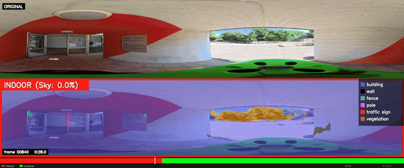
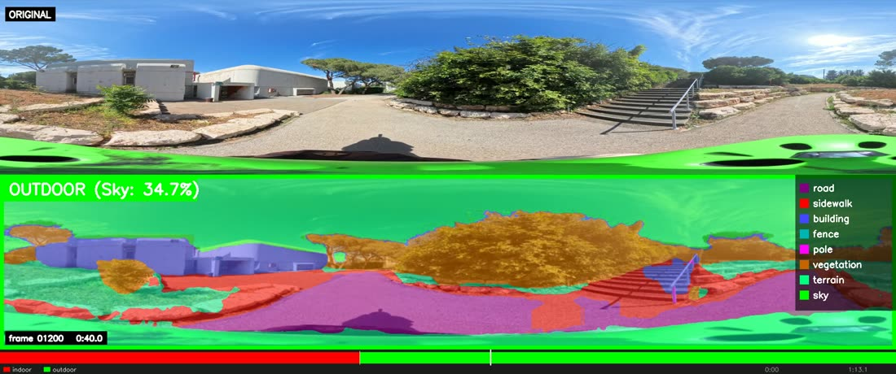
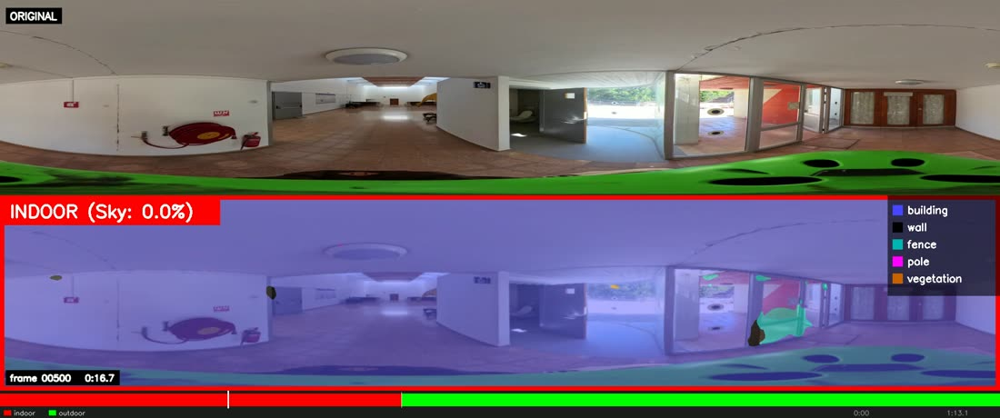

# 360° Panoramic Semantic Segmentation with Indoor/Outdoor Detection

Stage 1 of the Geo-Semantic Mapping methodology: a SegFormer (MiT-B2) model adapted to
equirectangular 360° video, producing a per-frame semantic mask and a per-frame
**indoor / outdoor** decision driven by the segmentation itself.

This repository is the **segmentation and indoor/outdoor component only**. It contains no
GPS handling, no visual odometry, and no map building — it takes a 360° video in and produces
masks, an indoor/outdoor timeline, and rendered video out.

## Demo

Video 093 — a 73-second walk that starts inside a building and exits onto a campus plaza. The
detector holds INDOOR for frames 0–879 and switches to OUTDOOR at frame 880. This clip is the
moment of that switch:



**▶ [Full comparison video, all 2191 frames](docs/093_original_vs_segmentation.mp4)** — 73 s,
1024 × 428, 5.5 MB, in this repo.

**▶ [Full-resolution render (2048 × 856, 90 MB)](https://drive.google.com/drive/folders/1jSh9xU82g6IQ3tPfcU-pAIANSwnkxuPX?usp=sharing)**
— in the Drive folder alongside the weights. This is the original render at the
model's native output geometry; the in-repo copy above is downscaled to keep clones small.

Top panel is the source frame, bottom is the segmentation overlay. The border and its label
carry the indoor/outdoor decision (green = outdoor, red = indoor) along with the sky fraction
that drove it; the legend lists only the classes actually present in that frame. The strip along
the bottom is the whole clip's indoor/outdoor timeline, red for indoor and green for outdoor,
with a white tick at each transition and a playhead tracking the current frame.

Two frames from the same clip, at full render resolution:



Outdoors, 40 seconds in. Sky at 22.8%, and the full outdoor class set is in play.



The same walk 23 seconds earlier, indoors. The class legend has collapsed to the indoor set —
road, sidewalk, terrain and vehicle are suppressed indoors by design (see *State-dependent
cleaning* below). Sky still reads 10.9% here, from the bright windows; this is exactly the case
the hysteresis and the raised indoor sky-confidence threshold exist to survive.

---

## Contents

| Path | Purpose |
|---|---|
| `video360_segformer.py` | The method. Runs segmentation + indoor/outdoor detection over a video or image folder. |
| `make_segmentation_comparison.py` | Builds the stacked original-vs-segmentation comparison video from a finished run. |
| `models/segformer/` | Model definition: `segformer.py` (the `Seg` wrapper), `MixT.py` (MiT encoder), `seghead.py` (SegFormer decode head). |
| `requirements.txt` | Pinned Python dependencies. |
| `docs/` | Sample output frames used above. |

---

## Requirements

### System

| | |
|---|---|
| OS | Linux (developed and verified on Ubuntu, kernel 6.17) |
| Python | **3.9** |
| GPU | NVIDIA, CUDA 11.3 build. Verified on a Tesla T4 (16 GB). |
| VRAM | ~2.6 GB in use at 2048×400 input — a 4 GB card is sufficient. |
| `ffmpeg` | Required by `make_segmentation_comparison.py` only. Must be on `PATH`. |

CPU-only execution works (`torch.cuda.is_available()` is checked and the code falls back), but
is impractically slow for video.

### Python packages

| Package | Version | Why |
|---|---|---|
| `torch` | 1.12.1+cu113 | |
| `torchvision` | 0.13.1+cu113 | `ToTensor` in the input transform |
| `numpy` | 1.26.4 | |
| `opencv-python` | 4.7.0.72 | video I/O, morphology, connected components, all drawing |
| `timm` | 1.0.22 | `DropPath`, `to_2tuple`, `trunc_normal_` in the MiT encoder |
| `mmcv-full` | 1.4.0 | `mmcv.cnn.ConvModule`, used by the decode head's `linear_fuse` |

`mmcv-full` is the awkward one: it is a compiled package that must match your torch and CUDA
build, and it is pinned to the 1.x API (`mmcv.cnn`), **not** mmcv 2.x. Install it from the
OpenMMLab wheel index as shown below so pip fetches a prebuilt wheel instead of compiling.

### Installation

```bash
conda create -n sfuda python=3.9 -y
conda activate sfuda

# 1. torch first, from the cu113 index
pip install torch==1.12.1+cu113 torchvision==0.13.1+cu113 \
    --extra-index-url https://download.pytorch.org/whl/cu113

# 2. mmcv-full from the OpenMMLab index, matched to torch 1.12 / cu113
pip install mmcv-full==1.4.0 \
    -f https://download.openmmlab.com/mmcv/dist/cu113/torch1.12.0/index.html

# 3. the rest
pip install numpy==1.26.4 opencv-python==4.7.0.72 timm==1.0.22

# 4. ffmpeg, for the comparison video
sudo apt-get install -y ffmpeg
```

Verify:

```bash
python -c "import torch, cv2, timm, mmcv; \
print(torch.__version__, torch.cuda.is_available(), cv2.__version__, timm.__version__, mmcv.__version__)"
# 1.12.1+cu113 True 4.7.0 1.0.22 1.4.0
```

---

## Weights

The trained weights are **not in this repository**. Download them from Google Drive and place
them in a `weights/` folder:

> **Download:** https://drive.google.com/drive/folders/1jSh9xU82g6IQ3tPfcU-pAIANSwnkxuPX?usp=sharing

```
weights/
├── city_b2_52.99.pth    # MiT-B2, 98 MB   <- default, use this
└── city_b1_50.19.pth    # MiT-B1, 56 MB   (smaller/faster backbone)
```

Checksums, to confirm the download arrived intact:

| File | Size (bytes) | MD5 |
|---|---|---|
| `city_b2_52.99.pth` | 103,302,919 | `c9c35ed6d32ddb3d74cce816c5c56373` |
| `city_b1_50.19.pth` | 59,063,807 | `9866e33c12304a722f3d6bf7487be8a7` |

```bash
md5sum weights/*.pth
```

The filename encodes the backbone and its mIoU on the evaluation set. The `--weights` flag is
the only thing that loads weights — `Seg(..., pretrained=True)` in the scripts is inert in this
version of the model wrapper and does not fetch anything from the network or disk.

Weights are loaded with `strict=False` after stripping any `module.` prefix left by
`DataParallel` training.

---

## Running

### 1. Segmentation + indoor/outdoor detection

```bash
python video360_segformer.py \
  --input_source /path/to/video_360.mp4 \
  --output_dir   ./output/my_run \
  --weights      ./weights/city_b2_52.99.pth \
  --output_fps   29.97
```

| Flag | Required | Meaning |
|---|---|---|
| `--input_source` | yes | A video file, **or** a directory of equirectangular stills (`.jpg/.jpeg/.png/.bmp`, processed in sorted order). |
| `--output_dir` | no | Default `./video_results`. |
| `--weights` | yes | Path to the `.pth` from Google Drive. |
| `--output_fps` | no | Frame rate for the written video. Defaults to 30. **Pass your source's real fps** (e.g. `29.97`) or the output will drift against the original. |

Input of any resolution is accepted; every frame is resized to the model's working geometry of
**2048 × 400** before inference.

### 2. The comparison video

```bash
python make_segmentation_comparison.py \
  --video   /path/to/video_360.mp4 \
  --seg_dir ./output/my_run \
  --output  ./output/my_run/comparison.mp4
```

| Flag | Required | Meaning |
|---|---|---|
| `--video` | yes | The same source clip you segmented. |
| `--seg_dir` | yes | The `--output_dir` from step 1. Reads `frames/` and `indoor_outdoor_status.csv`. |
| `--output` | yes | Destination `.mp4`. |
| `--fps` | no | Defaults to the source video's fps. |
| `--crf` | no | x264 quality, default 20. Lower is better and larger. |

Produces a **2048 × 856** H.264 video: 400 px original on top, 400 px overlay below, 56 px
timeline strip at the bottom. Both panels sit at the model's own 2048 × 400 geometry so their
columns correspond pixel-for-pixel — the only difference between the two panels is the
segmentation.

The original panel is the raw frame resized, *not* the pre-blurred tensor the overlay is drawn
on, so the comparison is against the video as shot.

---

## Outputs

`--output_dir` after a run:

```
output/my_run/
├── segmented_video.mp4          # overlay only, 2048x400
├── frames/frame_000000.png      # per-frame overlay, with border + legend
├── colored_masks/mask_000000.png# per-frame class mask, no overlay - the map stage's input
├── indoor_outdoor_status.csv    # frame,is_indoor
├── frame_object_stats.csv       # frame_id,class_id,class_name,pixel_area,area_percent,confidence
└── transitions/
    └── event_001_IN_to_OUT/     # +/- 1.5 s of overlay frames around each transition
```

`indoor_outdoor_status.csv` is the machine-readable result — one row per frame, `is_indoor`
as `True`/`False`. `frame_object_stats.csv` carries one row per class *present* in each frame,
so it is sparse, not a fixed 19 rows per frame.

---

## How the method works

### Segmentation

1. Resize to 2048 × 400, then downsample-and-restore at `SMOOTH_SCALE = 0.60`. This deliberate
   low-pass step suppresses the high-frequency stitching texture of 360 footage, which the
   model otherwise latches onto.
2. Forward pass → per-class softmax.
3. **Angular road/sidewalk prior.** A sigmoid ramp about a vanishing line (`VANISHING_X_PCT`,
   `HORIZON_Y_PCT`, `BOTTOM_ROAD_X_PCT`) suppresses road probability on one side of the line and
   sidewalk probability on the other. Road and sidewalk are otherwise near-indistinguishable in
   an equirectangular projection.
4. **Vehicle merge.** Classes 13–18 (car, truck, bus, train, motorcycle, bicycle) are summed
   into a single `vehicle` class.
5. `argmax` → mask, then three cleanups: median-blur any non-sky pixel below
   `CONF_TH_GENERAL = 0.70`; drop road/sidewalk/vehicle blobs under 400 px into sidewalk;
   morphologically close vertical gaps in the road.

### Indoor/outdoor decision

Frame 0 is classified on its own (`detect_initial_state_smart`): vegetation > 15% or vehicles
> 5% means outdoor; no sky, or mean sky confidence below 0.95, or under 25% sky in the top 10%
of the frame, means indoor.

Every frame after that is a **hysteresis** update on the current state, not an independent
classification — which is what stops a doorway or a bright window from flickering the label:

| Current | Switches when |
|---|---|
| Outdoor → Indoor | sky < 5% **or** (sky < 10% and sky dropped below 60% of the previous frame) — **and** vegetation < 5% **and** vehicles < 2% |
| Indoor → Outdoor | sky ≥ 15% **or** vegetation > 15% **or** vehicles > 5% |

Requiring all three signals to go quiet before declaring indoor, but any one to fire for
outdoor, biases the detector toward outdoor. Vegetation and vehicles are in the test because
sky alone fails under a canopy or an awning.

### State-dependent cleaning

The indoor/outdoor state feeds back into the mask:

- **Sky.** Sky pixels below `CONF_TH_SKY_OUTDOOR = 0.95` (`0.97` indoors) are reassigned to
  building. Indoors, sky components under 5000 px are also discarded — that is how ceiling
  lights and bright windows stop being labelled sky.
- **Indoor surfaces.** Indoors, road / sidewalk / terrain / vehicle are all forced to building.
  These classes cannot legitimately occur inside, and Cityscapes-trained models produce them
  readily on indoor flooring.

This means the masks are *not* independent of the indoor/outdoor decision. That is intentional,
but worth knowing before using the masks for anything else.

### Transition capture

Each state change writes a folder under `transitions/` holding `TRANSITION_WINDOW_SEC = 1.5`
seconds of overlay frames either side of the event, named `event_NNN_IN_to_OUT` or
`event_NNN_OUT_to_IN`.

---

## Classes

19 Cityscapes classes; 13–18 are merged into `vehicle` at inference.

| ID | Class | Colour | | ID | Class | Colour |
|---|---|---|---|---|---|---|
| 0 | road | purple | | 7 | traffic sign | bright red |
| 1 | sidewalk | red | | 8 | vegetation | dark orange |
| 2 | building | blue | | 9 | terrain | mint |
| 3 | wall | black | | 10 | sky | bright green |
| 4 | fence | teal | | 11 | person | pink |
| 5 | pole | magenta | | 12 | rider | light magenta |
| 6 | traffic light | cyan | | 13 | vehicle (13–18 merged) | deep blue |

Colours are chosen for separability in the overlay, not to match the Cityscapes palette. Masks
are written brightened by `convertScaleAbs(alpha=1.3)`; any downstream colour lookup must
account for that.

---

## Tuning

The constants at the top of `video360_segformer.py` are the intended tuning surface:

| Constant | Default | Effect |
|---|---|---|
| `CONF_TH_GENERAL` | 0.70 | Below this, a non-sky pixel gets median-blurred. |
| `CONF_TH_SKY_OUTDOOR` / `_INDOOR` | 0.95 / 0.97 | Sky confidence floor. Raise if interior lighting is being called sky. |
| `TARGET_W`, `TARGET_H` | 2048, 400 | Model input geometry. |
| `SMOOTH_SCALE` | 0.60 | Pre-inference low-pass. Raise toward 1.0 to keep detail; lower for noisier footage. |
| `TRANSITION_WINDOW_SEC` | 1.5 | Half-width of each saved transition clip. |
| `VANISHING_X_PCT`, `HORIZON_Y_PCT`, `BOTTOM_ROAD_X_PCT` | 0.45, 0.42, 0.75 | Geometry of the road/sidewalk prior. Camera-rig specific — re-fit these if your camera sits at a different height or offset from the path. |
| `FRAME_STEP` | 1 | Process every Nth frame. |

---

## Performance and practical notes

**Throughput is around 57 frames/minute** on a T4 at 2048 × 400 — about 36 minutes for a
73-second 30 fps clip. The bottleneck is **not** the GPU, which sits near 0% utilisation: it is
decoding 5760 × 2880 source frames and writing two full-size PNGs per frame. If you need speed,
the productive levers are dropping the per-frame PNG writes or raising `FRAME_STEP`, not a
bigger GPU.

**Disk.** Roughly 1.7 GB of output per 2200 frames, dominated by `frames/` and `colored_masks/`.
Point `--output_dir` at a volume with room.

**The nadir.** In footage from a handheld or helmet-mounted 360 rig, the bottom of every
equirectangular frame is the operator, and it is typically 15–20% of the frame height. It gets
segmented like anything else — usually as fence, terrain or building — and it inflates those
classes in `frame_object_stats.csv`. Exclude the bottom rows before using the class statistics
quantitatively.

**Error handling.** `run_inference` wraps the frame loop in a broad `except Exception` that
prints the error and then closes the video and CSVs cleanly, so a mid-run failure still leaves
usable partial output. It also means a failed run exits 0 — check that the frame count in
`indoor_outdoor_status.csv` matches your clip before trusting a run.

---

## Acknowledgements

Built on [360SFUDA](https://github.com/zhengxuJosh/360SFUDA) (Zheng et al.) and the SegFormer
architecture (Xie et al., NeurIPS 2021).
